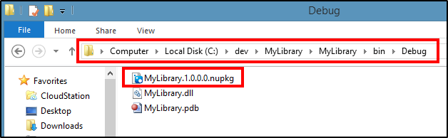

# NuGet Package To Automatically Create Your NuGet Packages
I've also created [a NuGet package called "Create New NuGet Package From Project After Each Build"](https://nuget.org/packages/CreateNewNuGetPackageFromProjectAfterEachBuild/) that you can include in your Visual Studio project that will call the New-NuGetPackage.ps1 script from your project's Post-Build events to automatically create a NuGet package every time your project builds.  So just add that NuGet package to your project and instantly you will have a NuGet package (.nupkg) created for your project that is always up-to-date with your last successful build.  The .nupkg file is placed in the project's output directory (i.e. in the same directory as the project's .dll/.exe).

Depending on the size of your project and it's dependencies, the time this adds to your build should not be noticeable (only a second or two during my tests).  Obviously the NuGet package does not automatically push the package to the gallery on every build though, as that would be very wasteful and would require more time each build.  Fortunately you can just run the script manually to push the package to the gallery (see below).

## Add The NuGet Package To Your Visual Studio Project

To add the "Create New NuGet Package From Project After Each Build" package to your project:

1. From Solution Explorer in Visual Studio, right-click on your project's **References** node and choose **Manage NuGet Packages...**

2. In the NuGet Package Manager, select **Online** from the menu on the left to search for packages online, and then in the search box on the top-right type in **"New NuGet Package"** (include the double quotes).  When the "Create New NuGet Package From Project After Each Build" package appears, click its **Install** button.

3. That's it. You should now see a **_CreateNewNuGetPackage** folder added to your project that contains the files used to create an NuGet package from your project after each build.

The only file that you need to be concerned about in here is the Config.ps1, as you can use it to configure how your package is built and uploaded (see below).

The NuGet.exe is included so that you are not required to have NuGet.exe added to your PATH in order for the script to run.  If you look in the project's properties you will also notice that a few lines were added to the Post-Build event section to call the CreateNuGetPackage.ps1 script.

## Generate Your Project's NuGet Package

Just build your project and the NuGet Package file (.nupkg) should get created in your project's output directory alongside the project's assembly.

## Specify A Specific NuGet Package Version, Release Notes, And More

If you want your NuGet package to have a different version than the assembly you are packing, or you want to provide release notes in your package, you can do so by providing values for the the **$versionNumber** and **$releaseNotes** variables in the **Config.ps1** file:

You may also specify any other Pack properties or options to pass to NuGet.exe in this file, such as to always include referenced project's assemblies in the package, or to exclude certain files from the package.

## Push Your Package To The NuGet Gallery

Since pushing your package to the NuGet Gallery is not automatic (intentionally), you still have to do that manually.  To make it easy, we can take advantage of scripts in the _CreateNewNuGetPackage folder to push the new NuGet Package to the Gallery:

1. Right-click on the **RunMeToUploadNuGetPackage.cmd** file in Visual Studio and choose **Run**. If you don't see **Run**, you can get this functionality by installing the [VSCommands Visual Studio extension](https://visualstudiogallery.msdn.microsoft.com/c6d1c265-7007-405c-a68b-5606af238ece).

Without VSCommands, you will need to run the batch file from Windows/File Explorer. You can easily do this by right-clicking the **_CreateNewNuGetPackage** directory and choosing **Open Folder in File Explorer**, and once the directory opens, double-click the **RunMeToUploadNuGetPackage.cmd** file.

2. It will then prompt you for the file to pack/push, so you can navigate to the project's output directory (e.g. \bin\Release) and choose the .nupkg file that you want to push.

**Note:** If you point the prompt to a project or .nuspec file (instead of a .nupkg file), it will prompt you for the version number and release notes to use for the package, rebuild the project and create/pack a new .nupkg file, and then upload that file. If you use this method, Visual Studio's current Configuration (e.g. Debug, Release) and Platform (e.g. x86, Any CPU) are ignored and the project is built with the defaults, which are typically Debug and x86, so this method is not recommended if you want to push a build with a specific Configuration and Platform.

3. When it prompts you if you want to push your package to the NuGet Gallery, choose **Yes**.

### Pushing To A Custom NuGet Gallery

If you plan on pushing your package to a custom server (instead of the default nuget.org), you can edit the **Config.ps1** file to specify your custom url. Just set the **$sourceToUploadTo** variable to your custom url.

Then when you run the RunMeToUploadNuGetPackage.cmd script it will push to your custom location.

## Troubleshooting Errors

If you want to see output from the New-NuGetPackage.ps1 script and NuGet.exe, take a look at the Build tab of Visual Studio's Output window.  It should show some additional information that can be very helpful for identifying and troubleshooting any problems that you may have.

## Known Issues and Workarounds

### New Package Not Created After Updating Version Number In .nuspec File

If your project has the version number explicitly defined in the .nuspec file and you:

1. build your project so it creates a .nupkg file of your project, then
1. change the version number in the .nuspec file, then
1. build your project again before making any changes

then it will not create your new .nupkg file.

**Workaround:** You have to either clean your solution and rebuild, or make changes to the project and build again.

The reason for this is by default the Post-Build events are set to run "On successful build", and if a project has not been changed, when you tell it to build it doesn't actually do a build, so the Post-Build events do not get executed.
